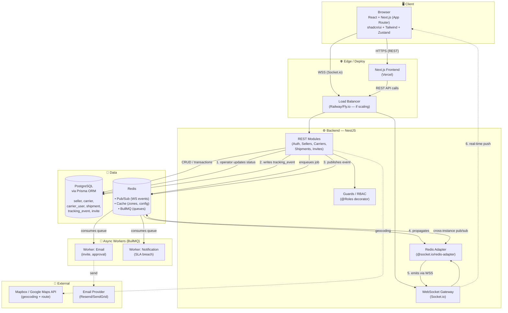

# Mini TMS — Design Doc

> Simplified Transportation Management System (TMS), covering seller onboarding, multi-tenant carrier management, and real-time delivery tracking.

---

## 1. Project Goal

Build a full-stack system that reflects, in a simplified but architecturally honest way, the real challenges of a logistics platform: multiple organization types interacting (sellers and carriers), controlled approval and onboarding, real-time delivery tracking, and genuine multi-tenancy.

Portfolio project — not a commercializable product. It demonstrates real domain modeling, multi-layer RBAC enforced in the backend, and a real-time architecture that scales horizontally (WebSocket + Redis pub/sub).

## 2. System Roles

| Role | Who they are | How they enter the system |
|---|---|---|
| **Admin** | Platform owner | Created via seed, never through a public screen |
| **Seller** | Merchant who needs to ship products | Public self-signup → onboarding → approval |
| **Carrier (manager)** | Responsible for the carrier company | Company registration → admin approval |
| **Carrier (operator)** | Executes day-to-day deliveries | Invited via token, sent by the carrier's manager (not yet built — see § 17) |

Carriers are companies with multiple logins (a manager plus any number of operators), not a single account per carrier — that's what makes the multi-tenancy real instead of just a `role` column.

## 3. User Journey

Full flow per role, including entry points (self-signup vs. invite vs. seed) and the screens at each step.


The shipment queue is shared within each carrier (every operator sees everything), but each shipment has an optional "owner." With no owner, any operator can claim it (`self-assign`); once claimed, only that owner (or a manager, to unblock operations) can act on it.

## 4. System Screens

**Admin:** Dashboard, Sellers List, Seller Detail, Carriers List, Carrier Detail (with a sub-list of operators and invites), Global Monitoring.

**Seller:** Onboarding (multi-step with draft), Dashboard, Create Shipment, Shipments List, Shipment Detail, Modality Configuration.

**Carrier:** Company Registration, Operator Management (manager only), Invite Acceptance, Dashboard/Queue, Status Update, Performance.

**Public:** Invite Acceptance, Tracking without login.

Detailed screen-by-screen specification — role, displayed data (real schema fields), actions, and states — in [`SCREENS.md`](./SCREENS.md).

## 5. Technical Architecture



The BullMQ workers and external map/email providers in the diagram are roadmap items (§ 17) — not implemented yet. Everything else in the diagram is live.

### Real-time flow (the project's technical core)

1. An operator updates a shipment's status via REST.
2. The backend writes a new `tracking_event` to Postgres (immutable history — it never overwrites the previous status).
3. The backend publishes the event on a Redis channel.
4. Redis propagates the event to every subscribed API instance — this is what allows horizontal scaling without losing messages between different servers.
5. The Redis adapter delivers the event to the corresponding WebSocket Gateway.
6. The Gateway emits it via WSS to connected clients (the seller following the shipment, the admin on the global monitor).

## 6. Stack

| Layer | Choice | Why (short version) |
|---|---|---|
| Backend | NestJS (Node) | WebSocket is native to Node; real-time is the core of the project |
| Database | PostgreSQL + Prisma | Domain with strong relationships and a need for transactional integrity |
| Real-time | Socket.io + Redis pub/sub adapter | Scales across multiple API instances without losing messages |
| Queue (roadmap) | BullMQ on Redis | Reuses the same Redis infra already needed for pub/sub |
| Frontend | React + Next.js (App Router) | Role-based routes (admin/seller/carrier) with distinct layouts |
| Design system | shadcn/ui + Tailwind | Headless primitives, built into dense table/dashboard components |
| Infra | Docker Compose locally, Railway/Fly.io for deploy | Cost/setup speed fitting a portfolio project |

## 7. Roadmap (Advanced Features / Next Steps)

Not started yet:

- **Operator invites** — `Invite` token flow, Operator Management screen, `InviteAccept` entry point (§ 3, § 4).
- **`notifications` module** — currently an empty scaffold; will host BullMQ workers for email (invite, approval) and SLA-breach alerts.
- Automatic rule-based assignment (round-robin or operator coverage zone).
- Routing engine (suggesting the optimal delivery order).
- Delay prediction via a simple model over historical data.
- Natural-language assistant querying metrics ("how many late deliveries this week").
- Multi-tenancy with data isolation via dedicated rate limiting.

## 8. Running Locally

### Repository Structure

```
tms/
├── DESIGN.md
├── docker-compose.yml       # local infra: Postgres + Redis
└── apps/
    ├── api/                 # NestJS — backend
    │   ├── prisma/schema.prisma
    │   ├── src/prisma/      # PrismaModule + PrismaService (global)
    │   └── .env             # DATABASE_URL (not versioned)
    └── web/                 # Next.js — frontend
```

Folder-based "monorepo" (`apps/api`, `apps/web`), each with its own `package.json`/lockfile — no monorepo tooling (Turborepo/Nx), since the two apps don't share code yet.

### Infra (Postgres + Redis)

```bash
docker compose up -d
```

| Service | Port | Credentials (dev) |
|---|---|---|
| `postgres` (postgres:16-alpine) | `localhost:5432` | `tms` / `tms` / db `tms` |
| `redis` (redis:7-alpine) | `localhost:6379` | no password |

### Backend (`apps/api`)

```bash
cd apps/api
pnpm install       # postinstall runs `prisma generate` on its own
pnpm start:dev     # prestart:dev runs `prisma migrate deploy` on its own — http://localhost:3333
```

`.env` already points at the compose infra and fixes `PORT=3333` (Next.js defaults to 3000, so both dev servers run at once without conflict).

Changing `schema.prisma` and generating a new migration is always a manual, deliberate step: `pnpm exec prisma migrate dev --name <name>`.

### Frontend (`apps/web`)

```bash
cd apps/web
pnpm install
pnpm dev                    # http://localhost:3000
```

`NEXT_PUBLIC_API_URL` (in `.env.local`) points to the API at `http://localhost:3333`.

## 9. Frontend Architecture

Structure inspired by [bulletproof-react](https://github.com/alan2207/bulletproof-react): organized by **business domain**, not by technical file type — `features/sellers` holds everything related to sellers (components, hooks, API calls, types), with no generic `hooks/` folder mixing unrelated features.

```
apps/web/src/
├── app/                      # ONLY routing (App Router) — layouts, pages, route groups
│   ├── admin/                # dashboard, sellers, carriers, monitoring
│   ├── seller/                # dashboard, shipments, onboarding
│   ├── carrier/               # dashboard, queue, performance
│   ├── invite/accept/        # invite acceptance (public, via token)
│   ├── track/                # public tracking (no login)
│   └── providers.tsx         # QueryClientProvider
├── features/                 # one domain per folder
│   ├── auth/ · sellers/ · carriers/ · shipments/ · tracking/
│   │   ├── components/ · hooks/ · api/ · types.ts
├── components/                # truly shared UI (ui/ and common/)
├── hooks/                     # generic hooks, not tied to any domain
├── lib/                       # domain-agnostic utilities
├── services/                  # api-client.ts (typed fetch), websocket-client.ts
└── store/                     # Zustand — only genuinely global UI state
```

**Dependency rule:** `shared (components/, lib/, hooks/) → features/ → app/`. A feature can import from shared, never directly from another feature; `app/` composes pages from `features/`.

**Where state lives:** server data → TanStack Query (shipments list, approval status, carrier data — always via `features/*/api/`); pure client UI state → Zustand or local `useState` (table filters, sidebar, theme). API responses never get copied into Zustand.

**Server vs. Client Components:** everything is a Server Component by default; `'use client'` only where there's real interactivity (forms, WebSocket subscriptions, state hooks), pushed to the leaves of the tree rather than wrapping whole pages.

## 10. Data Model

11 tables in `apps/api/prisma/schema.prisma`. Auth (`User`) is separate from domain profile (`Seller`, `CarrierUser`) — an Admin is just a `User` with `role: ADMIN`, with no table of its own.

```
User ──1:1── Seller ──1:N── Shipment ──N:1── DeliveryModality
  └──1:1── CarrierUser ──N:1── Carrier ──1:N── Invite
                                  ├──1:N── CarrierCoverageArea
                                  ├──1:N── CarrierModality ──N:1── DeliveryModality
                                  └──1:N── Shipment (optional owner via CarrierUser)

Seller ──1:N── SellerModality ──N:1── DeliveryModality
Shipment ──1:N── TrackingEvent (immutable history, never UPDATE)
```

**What each table is for:**

- **`Seller`** — a merchant company. `status` (`PENDING`/`APPROVED`/`REJECTED`) gates whether it can create shipments.
- **`Carrier`** — a transportation company, same approval `status`. Has no direct link to a `User`; it's reached through `CarrierUser`.
- **`CarrierUser`** — one row per person working at a carrier, with a `role` (`MANAGER`/`OPERATOR`) scoped to that one carrier. This is what makes a carrier genuinely multi-user, unlike a `Seller` (one user per company by design, via a unique `userId`).
- **`Invite`** — token-based invitation a manager sends to add an operator (roadmap, § 7 — not built yet).
- **`DeliveryModality`** — a configurable catalog (`STANDARD`/`FULL`/`EXPRESS`, seeded), not a fixed enum, so both sellers and carriers can independently declare what they enable/offer.
- **`SellerModality`** / **`CarrierModality`** — join tables: which modalities a seller has enabled, which a carrier actually operates.
- **`CarrierCoverageArea`** — which `state`/`city` a carrier delivers to (`city` nullable means "entire state"). This is what a shipment's eligible-carriers lookup matches against.
- **`Shipment`** — the core record: seller, chosen carrier, modality, address (as real columns — `addressCity`/`addressState`/etc. — not a JSON blob, since coverage matching needs to filter/index by them), a generated `trackingCode`, and a 9-state `status`.
- **`TrackingEvent`** — one immutable row per status change, the source of both the live WebSocket feed and the public tracking timeline.

**Shipment status machine:** `PENDING → ACCEPTED → COLLECTED → OUT_FOR_DELIVERY → DELIVERED`, with `FAILED_DELIVERY → RETURNED` as the one failure branch and `CANCELLED` only possible before `COLLECTED`. Forward-only transitions are enforced in code (`shipment-status.util.ts`), not just documented.

**`GlobalRole` vs. `CarrierRole`:** two separate enums. `GlobalRole` (`ADMIN`/`SELLER`/`CARRIER_MANAGER`/`CARRIER_OPERATOR`) is the identity role on `User`, driving the JWT and the `RolesGuard`. `CarrierRole` (`MANAGER`/`OPERATOR`) is scoped to one `CarrierUser` within one `Carrier` — it exists because a carrier can have several people with different in-company roles, which a single global role couldn't express without also allowing invalid combinations like a `CarrierUser` typed `ADMIN`.

## 11. Auth & Authorization

- `POST /auth/login` — validates email/password (bcrypt), returns a JWT (`sub`, `email`, `role`).
- `JwtStrategy` validates the token on every protected request and reloads the `User` from the database, so a deleted user doesn't stay "authenticated" just because the token hasn't expired.
- `JwtAuthGuard` requires a valid token; `RolesGuard` + `@Roles(...)` requires a specific role. `@CurrentUser()` extracts the authenticated user in handlers without repeating `request.user`.
- **Ownership-based checks**, layered on top of RBAC: a seller can only see their own record, a carrier user only their own company. There's no generic guard for this (every entity has a different owner FK), so each module's service scopes its own queries — e.g. `GET /shipments/:id` is fetched with `sellerId` inside the `WHERE` itself, and a shipment belonging to someone else returns `404`, not `403` (a `403` would confirm the id refers to a real record owned by someone else — an account-enumeration leak the ownership pattern deliberately avoids everywhere it's used).

## 12. Sellers

- **Self-signup** (`POST /sellers`, public) — creates a `User` (role `SELLER`) and `Seller` together in one transaction, initial `status: PENDING`. Duplicate email/document returns a generic `409` (no field named), avoiding an account-enumeration oracle on a public endpoint.
- **Admin approval loop** — `GET /sellers` (paginated, filterable by `status`), `GET /sellers/:id`, `PATCH /sellers/:id/approve` / `.../reject`. Approving/rejecting a seller that isn't currently `PENDING` is a `409`, not a silent no-op.
- **Own profile** — `GET /sellers/me`; modality config via `GET`/`PUT /sellers/me/modalities` (full-replace semantics: the client always submits the complete enabled set, not incremental toggles).
- **Status counts** — `GET /sellers` backs an admin list; a dedicated `groupBy` endpoint feeds the seller and admin dashboards (§ 16) with per-status counts in one query instead of one `findAll` per status.

## 13. Carriers

Mirrors the sellers flow, with one structural difference: a carrier's "owner" is a `CarrierUser`, not the `Carrier` itself, so signup writes three rows (`User` role `CARRIER_MANAGER` → `Carrier` `status: PENDING` → `CarrierUser` role `MANAGER`) in one transaction.

- **Self-signup + admin approval loop** — same shape as sellers (§ 12): `GET`/`PATCH /carriers/:id/approve|reject`, same `409` state-transition guard, same generic duplicate-conflict message.
- **Own profile** — `GET /carriers/me` (open to managers and operators alike — viewing the company isn't a manager-only action). Modality and coverage-area config (`/carriers/me/modalities`, `/carriers/me/coverage-areas`) are `CARRIER_MANAGER`-only to mutate, full-replace semantics, same as sellers' modality config.
- **Not yet implemented:** operator invites (§ 7).

## 14. Shipments

- **Eligible-carriers preview** — `GET /shipments/eligible-carriers?state=&city=&modalityId=` cross-references `CarrierCoverageArea` + `CarrierModality` + `Carrier.status = APPROVED`, returning the carriers the seller can pick from. This is a manual choice, not automatic assignment (§ 7 roadmap).
- **Creation** — `POST /shipments` re-validates everything the preview implied, server-side, against the exact submitted `carrierId`/`modalityId`/address: nothing enforces a client actually used the preview before submitting. Generates a `trackingCode` (`TMS-` + 12 hex chars).
- **Matching normalization** — `state` is uppercased at write time (keeps the comparison a plain indexable equality); `city` stays case-insensitive at query time, preserving its display casing.
- **Reading shipments back** — `GET /shipments` / `GET /shipments/:id`, scoped to the caller's own `sellerId` inside the query itself; someone else's shipment returns `404`, same ownership pattern as § 11.
- **Not yet implemented:** shipment cancellation flow (open product decision, see `SCREENS.md`'s Known Gaps).

## 15. Carrier Queue & Real-Time Tracking

- **Claim** — `PATCH /shipments/:id/claim`: any manager or operator of the carrier can claim a shipment, only while `ownerId` is still null (`409` if already claimed).
- **Update status** — `PATCH /shipments/:id/status`: the owning `CarrierUser`, or any manager of that carrier (to unblock operations if the owner is unavailable); a non-owning operator gets `403`. A still-unclaimed (`PENDING`) shipment is rejected outright, pointing callers at `/claim` first — this stops a manager from silently skipping the claim step and corrupting the "claimed implies owned" invariant.
- **Queue reads** — `GET /shipments/queue` and `/queue/:id`, the carrier-facing views (distinct DTOs from the seller-facing ones, since a carrier's view includes seller contact + owner info the seller's own view has no reason to see about itself).
- **Real-time push** — every claim/status update emits `shipment.status-changed` internally; `TrackingListener` relays it over Socket.io to three rooms: `shipment:{id}` (seller + carrier viewing that one shipment), `carrier:{carrierId}` (the queue list), and `admin:monitoring` (§ 16). Room-membership checks re-run the same ownership scoping as the REST endpoints — subscribing to someone else's room is silently rejected.
- **Horizontal scaling** — a Redis adapter (`@socket.io/redis-adapter`) sits behind the gateway so `.emit()` calls propagate across every API instance subscribed to the same channel, not just the instance that handled the request.
- **Public tracking** — anyone with a `trackingCode` can look up a shipment's current status and event timeline with no login, without exposing the seller's full address or internal notes.
- **Known limitation:** no unique constraint stops two operators from both reading `ownerId: null` before either writes — a real (if narrow) double-claim race exists at this scale, documented rather than silently assumed airtight.

## 16. Dashboards, Carrier Performance, and Global Monitoring

- **Seller Dashboard** — `Pending`/`In transit`/`Delivered`/`Total` stat tiles (plus an `other` bucket covering every status without its own tile, so the tiles always add up to the total) and the 5 most recent shipments. A seller with zero shipments gets a "create your first shipment" empty state instead of all-zero tiles.
- **Admin Dashboard** — seller/carrier totals plus a pending-approval count for each, linking straight into that approval queue.
- **Carrier Performance** — `GET /carriers/me/performance`: shipment counts by status, `failedDeliveryRate`/`returnedRate`, and `avgHoursBetweenEvents` (average time between consecutive tracking events, computed in application code). `null` (not `0`) when there isn't enough data yet, so the UI can distinguish "no data" from "instantly fast."
- **Admin Global Monitoring** — `GET /admin/shipments`, filterable by `status`/`carrierId`/`sellerId`, the one list endpoint with no ownership scoping (gated purely by the `ADMIN` role) — every one of the system's shipments, across every seller and carrier, in one table with all 9 statuses individually selectable.
- **Known gap:** a live status-change push refetches the queue/detail/monitoring table, but dashboard stat tiles and Carrier Performance only pick up new numbers on next mount or manual refresh — the count endpoints aren't yet part of the WebSocket invalidation set.

## 17. Code Quality & CI

- **Biome** — single tool for lint + format across both apps (`pnpm lint` locally with `--write`, `pnpm lint:ci` without, for CI).
- **lefthook** — `pre-commit` runs lint-staged; `commit-msg` validates Conventional Commits via commitlint.
- **Vitest** — unit (`*.spec.ts`) and e2e (`test/**/*.e2e-spec.ts`) tests in `apps/api`; component/hook tests in `apps/web`.
- **GitHub Actions** (`.github/workflows/ci.yml`) — three jobs on every push/PR to `main`: `commitlint` (PRs only), `api` (lint:ci → build → unit → e2e against a real Postgres service container), `web` (lint:ci → build, which includes Next's type-check). Branch protection on `main` requires all three green.
- Zod validates env vars at boot (`DATABASE_URL`, `PORT`, `JWT_SECRET`, `CORS_ORIGIN`, `NODE_ENV`) — a missing/invalid one fails fast with a clear message instead of surfacing later as a confusing runtime error.
- Swagger (`/docs`) documents every implemented module; a module still a skeleton is deliberately left undocumented rather than describing an endpoint that doesn't do anything yet.
